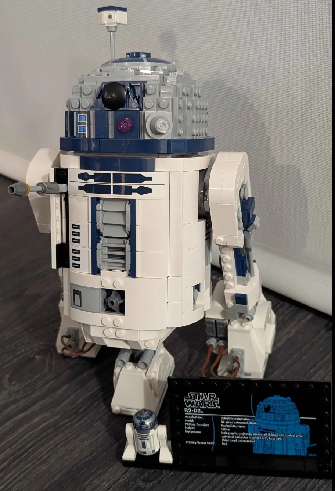

# Hey R2
Interactive R2-D2 bot that responds to voice commands with its classic droid sounds based on emotional context.

## Overview
*Hey-R2* is a voice-activated bot that mimics R2-D2's communication style. Say the wake word to get its attetntion, give a command, and R2 responds with appropriate beeps, whistles, and chirps based on the context of your message.

## How It Works
The bot follows this workflow:
1. **Wake Word Detection**    - Listens for custom "Hey R2" wake word using OpenWakeWord
2. **Speech Recognition**     - Records 3 seconds of audio and converts it to text using Whisper
3. **Emotion Classification** - Analyzes command using local LLM (Mistral 7B through ollama) to determine emotional context
4. **Audio Response**         - Plays a random R2-D2 sound from the appropriate emotion category

## Emotion Categories
The bot classifies commands into 5 emotional categories:
- **Happy**       - Greetings, positive statements, celebrations
- **Curious**     - Questions, confusing statements, requests for information  
- **Concerned**   - Problems, help requests, sad situations
- **Scared**      - Danger warnings, threats, emergencies
- **Acknowledge** - Neutral responses, unclear commands, status requests, simple yes/no

## Tools & Technologies
- **Wake Word Detection**: OpenWakeWord with custom trained "Hey R2" model
- **Speech-to-Text**:      OpenAI Whisper (base model)
- **Language Model**:      Ollama with Mistral 7B for emotion classification and deliberate prompting for consistent desired results
- **Audio Processing**:    PyAudio for recording, Pygame for playback
- **Audio Files**:         Authentic R2-D2 sound clips organized by emotion found online

## Project Structure
```
Hey-R2/
├── main.py                           # Main bot loop
├── audio/
│   ├── recorder.py                   # Audio recording and playback
│   ├── wake_word.py                  # Wake word detection
│   └── sounds/                       # R2-D2 audio files by emotion
│       ├── happy/
│       ├── curious/
│       ├── concerned/
│       ├── scared/
│       └── acknowledge/
├── processing_unit/
│   ├── speech_to_text.py            # Whisper transcription
│   └── emotion_classifier.py        # LLM emotion classification
└── config.py                        # Configuration settings
```

## Installation
This project was developed using Python 3.10 in a Conda environment:

```bash
conda create --name heyr2 python=3.10
conda activate heyr2
```

### Install Dependencies
```bash
# Core packages
pip install -r requirements.txt
```

### Install Ollama
Download and install Ollama from https://ollama.com, then pull the required model:
```bash
ollama pull mistral:7b
```

### Setup Wake Word Model
Train a custom "Hey R2" wake word model using the OpenWakeWord Colab notebook, or use a pre-trained model like "hey_jarvis_v0.1" for testing.

## GPU Acceleration
Having PyTorch with CUDA support significantly speeds up LLM inference, allowing use of larger, more accurate models like Mistral 7B.
Smaller models (1B) often have trouble following prompts and sticking to one-word responses.
```bash
# Install PyTorch with CUDA (optional but recommended)
pip install torch torchvision torchaudio --index-url https://download.pytorch.org/whl/cu118
```

## Running the Bot
Start the interactive R2-D2 bot:
```bash
python main.py
```

Test individual components:
```bash
# Test emotion classification
python processing_unit/emotion_classifier.py

# Test audio playback
python audio/recorder.py
```

## Usage
1. Run the bot and wait for "R2-D2 Bot starting..." message
2. Say your wake word "Hey R2"  
3. Wait for "Listening for command..." prompt
4. Speak your command clearly within 3 seconds
5. R2 will respond with appropriate droid sounds
6. Appropiate emotion is also printed to verify the prompting is done right

Example interactions:
- "Hey R2" → "Hello there!" → *Happy R2 chirps*
- "Hey R2" → "What's that noise?" → *Curious R2 whistles*
- "Hey R2" → "Obi Wan is dead!" → *Sad R2 warbles*
- "Hey R2" → "Danger!" → *Scared R2 alarms*

## Troubleshooting
If you encounter NumPy compatibility issues with OpenWakeWord:
```bash
pip install "numpy<2"
```
Look at the comments in requirements.txt for other dependencies, links, or system-specific considerations for these packages.

For ALSA audio warnings on Linux, these are typically harmless driver messages that can be ignored.

## Future Enhancements
- Voice modulation effects
- Smart home integration
- Multiple R2 personalities
- Sequential emotional responses
- Edge deplyoment

<div align="center">

</div>

## Acknowledgements
- OpenAI Whisper for speech recognition
- OpenWakeWord for wake word detection. See its linked Google Colab notebook for custom wakeword
- Ollama for local LLM inference
- R2-D2 sound effects from 101SoundBoards.com
